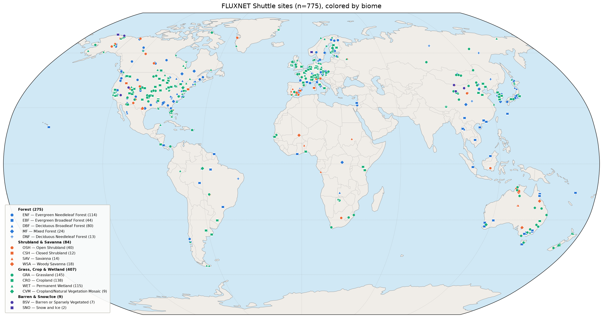

# fluxnet-shuttle-ecland

Scripts and configuration to run [ecLand](https://www.ecmwf.int/en/research/modelling-systems/land-surface) land-surface model simulations over flux-tower sites discovered live via the [FLUXNET Shuttle](https://github.com/fluxnet/shuttle) — extending beyond the fixed 170-site [PLUMBER2](https://essd.copernicus.org/articles/14/449/2022/) benchmark (see sibling repo [plumber2-ecland](https://github.com/gpbalsamo/plumber2-ecland), which this repo forks most of its `scripts/` from) into the wider, continually-growing pool of sites now available across AmeriFlux, ICOS and TERN.

As of the 2026-08-18 live Shuttle snapshot: **775 sites** (AmeriFlux 381, ICOS 342, TERN 52) vs PLUMBER2's 170 — including biomes/regions PLUMBER2 underrepresents (savanna, Mediterranean shrubland, Sahel, boreal/tundra), which is the actual motivation: a CoFLAME-facing gap around fire-prone and vegetation-stress biomes.



Generated with `scripts/plot_sites_map.py --snapshot-csv <listall snapshot>` — the same script (forked as-is from `plumber2-ecland`) that renders that repo's 170-site map, extended with a fourth Barren & Snow/Ice biome group and `DNF`/`CVM` IGBP classes for the sites outside the original PLUMBER2 pool.

## Status (2026-08-20)

**Forcing now exists for the whole live site pool.** A full run on ECMWF HPC (2026-08-18 snapshot, ERA5 gapfilling, `complete` preset, NOAA CO2 fill) produced ecLand-ready forcing for **775 / 775 sites — 5397 site-years**, median 5 years per site, max 31:

| hub | sites | site-years |
|---|---|---|
| AmeriFlux | 381 / 381 | 2513.1 |
| ICOS | 342 / 342 | 2511.1 |
| TERN | 52 / 52 | 373.0 |

By IGBP: GRA 145, CRO 138, WET 115, ENF 114, DBF 80, EBF 44, OSH 40, MF 24, WSA 18, SAV 14, DNF 13, CSH 12, CVM 9, BSV 7, SNO 2 — the fire/vegetation-stress classes that motivate this repo (SAV/WSA/OSH/CSH/GRA) come to **228 sites**, against PLUMBER2's 170 in total.

Gap-fill intensity across all 7750 (file, variable) records, from `reference/qc_report_shuttle-all775-era5.csv`: mild 3755, medium 1603, heavy 1169, complete 1223. Roughly half the delivered data is lightly gap-filled; the heavily-filled remainder is labelled per file and variable rather than mixed in silently. Reaching full coverage does depend on ERA5 — sites vary from near-pure observations to records where pressure and precipitation are largely reanalysis.

**The whole pool has been run end to end**: physiography and initial conditions for 775/775 (see [Physiography](#2c-physiography-and-initial-conditions)), then ecLand, postprocessing and benchmarking over all 775 sites — median `r` of 0.79 (`Qle`) and 0.82 (`Qh`) against the towers. See [Results](#61-results-the-full-775-site-run).

What's validated vs. what's still open:

**Validated end-to-end, on real data:**
- Physiography and initial conditions for an arbitrary site coordinate, at O1280 (~9 km), via `scripts/extract_physiography_batch.sh` — validated on 16 sites spanning boreal, Mediterranean mountain, Sahel, tropical, desert, coastal-marsh and Australian savanna cases before launching the full group.
- Live Shuttle inventory pull, IGBP/record-length filtering, and download (`fluxnet-shuttle listall`/`download` + `scripts/filter_candidate_sites.py`) — see `reference/shuttle_pilot20_site_ids.txt` for the current 20-site fire/vegetation-stress pilot shortlist.
- FluxnetLSM conversion of a real downloaded site (ES-LJu, ICOS) to ALMA-CF NetCDF (`scripts/install_fluxnetlsm.R` + `scripts/convert_fluxnetlsm.R`) — variables/dims are byte-identical to an existing PLUMBER2-170 file.
- `scripts/regenerate_forcing.sh` (forked unmodified from `plumber2-ecland`) converts that FluxnetLSM output to ecLand's forcing convention with **no changes needed**. This was the step flagged as the real engineering risk going in; it isn't one for Shuttle-sourced sites.
- The whole download → convert → forcing chain, batched over an arbitrary site list by `scripts/run_forcing_pipeline.sh` (streaming, resumable, parallel — see [Batch-process many sites](#2-batch-process-many-sites)).
- ERA5 gapfilling against the Shuttle's own `*_ERA5_HH_*.csv`: FluxnetLSM's `ERAinterim` path is fully compatible with it despite the product-name difference (columns and half-hour timestamps line up exactly for the join FluxnetLSM does — see `scripts/convert_fluxnetlsm.R`'s header).

**Real findings about the expanded site pool** (not bugs — they shape how you run the pipeline):
- PLUMBER2-style QC screening is strict against sites outside the original pool: ES-LJu's real 21-year record only yielded 2 usable years under statistical gapfilling. Expect similar attrition elsewhere — hence the acceptance presets below, rather than one fixed threshold set.
- FluxnetLSM's default `check_range_action="stop"` discards a site's **entire** multi-year record over a single implausible value anywhere in it; this alone killed SN-Dhr and US-ICt over one bad PA/VPD value from an ERA5 extraction edge case. The `heavy`/`complete` presets use `truncate` instead.
- Because acceptance thresholds only decide what gets *written out* (gapfilling always runs first regardless), the real per-variable gap-fill fraction is recorded in every output file. `scripts/qc_classify.py` reads it back, so how much you trust a period is a filtering decision made *after* processing, not a rerun.
- **Gapfill method dominates yield, far more than the preset does.** The same 775 sites and the same `complete` preset gave 231 sites / 505 files under statistical gapfilling but **775 / 775** under ERA5. Statistical filling cannot close long gaps, and FluxnetLSM's `missing_met` threshold (default 0) then discards the whole year.
- **CO2 was silently costing 97 sites.** `missing_met=0` drops a year if *any* met variable still has a gap, and CO2 is the one met variable the Shuttle's ERA5 file cannot fill (`ERAinterim_variable=NA` in FluxnetLSM's own schema — reanalysis surface files carry no atmospheric CO2). Those sites were being discarded over a variable ecLand is not driven by here (`LEAIRCO2COUP=.FALSE.`; CO2 appears only as model output). `scripts/fill_co2_from_noaa.py` fills it from the NOAA GML monthly global mean, flagged QC=3 so it still reports as gap-filled — recovering all 97 sites and 264 site-years without touching any acceptance threshold.
- **One site is blocked by upstream metadata, not by data.** FluxnetLSM's packaged `Site_metadata.csv` marks CZ-BK2 `Exclude=TRUE` with `Exclude_reason=NA`, aborting conversion before any data is read. Verified it converts to a complete 7-year record; `build_site_metadata.py` carries a documented override (`EXCLUDE_OVERRIDES`), reversible with `--respect-upstream-excludes`.

**The physiography blocker is solved** (2026-08-20). Producing `clim/<group>/surfclim_<site>_<Y1>-<Y2>.nc` and `surfinit_<site>_<Y1>-<Y2>.nc` — soil type, vegetation cover and type, orography, lake and ice masks, LAI, albedo, and the initial state of the prognostic variables — for an arbitrary site coordinate was the one thing standing between this forcing dataset and running ecLand over it. The [`ecland-portal`](https://github.com/gpbalsamo/ecland-portal) repo drives ecLand's own `create_forcing` tool to do exactly that for any lat/lon, and `scripts/extract_physiography_batch.sh` runs it over a whole site group. See [Physiography](#2c-physiography-and-initial-conditions).

It is fast, because the expensive part of `create_forcing` is a step we don't need: the static fields are a disk copy from `/home/rdx/data/climate/climate.<version>/<grid>`, and only the initial-conditions analysis goes to MARS. About 60–90 s per site, against the hour-per-month that retrieving *meteorological* forcing from MARS would cost — our forcing comes from the towers instead.

With that in place, nothing structural remains: `scripts/run_parallel_local.sh` already produced the full 170-site PLUMBER2 benchmark on a Mac (GPU-accelerated, 8 concurrent workers; see `plumber2-ecland/benchmark/dashboards/`), and `ecland_run.sh` is the HPC equivalent, so running ecLand and postprocessing/benchmarking it is not an open problem.

## Pipeline

```
scripts/install_fluxnetlsm.R (once per machine)      # R + FluxnetLSM, with a documented sf/lutz workaround

fluxnet-shuttle listall                              # live site inventory -> snapshot CSV
  -> scripts/build_site_metadata.py                   # FluxnetLSM's 874-site table + Shuttle sites -> merged site CSV
  -> scripts/fetch_noaa_co2.py                        # NOAA GML monthly CO2 -> CO2 fallback table (once)
  -> scripts/filter_candidate_sites.py                # IGBP/record-length filter, exclude PLUMBER2-170 (optional)
  -> scripts/run_forcing_pipeline.sh                  # batch driver, per site:
       fluxnet-shuttle download                       #   per-site zip -> FLUXMET (+ optional ERA5) HH CSV
       -> scripts/fill_co2_from_noaa.py               #   fill missing CO2 (-C), which ERA5 cannot supply
       -> scripts/convert_fluxnetlsm.R                #   FLUXMET CSV -> ALMA-CF Met/Flux NetCDF (--preset, --gapfill)
       -> scripts/regenerate_forcing.sh               #   -> ecLand forcing convention (lon/lat/time, PSurf/Rainf)
  -> scripts/qc_classify.py                           # post-hoc: real per-variable gap-fill % -> mild/medium/heavy/complete

scripts/extract_physiography_batch.sh                # per site, via ecland-portal + ecLand's create_forcing:
                                                     #   static fields off disk at O1280 (~9 km) -> surfclim_<site>_<Y1>-<Y2>.nc
                                                     #   one MARS analysis      -> surfinit_<site>_<Y1>-<Y2>.nc
  -> scripts/check_physiography.py                    # refuse NaN/no-land output instead of poisoning a run
  -> scripts/ecland_run_experiment.sh / run_parallel_local.sh   # runs locally on macOS (or HPC via ecland_run.sh)
  -> scripts/postproc.py                               # raw ecLand output -> common schema
  -> scripts/benchmark.py                              # score vs. flux obs -> dashboard
```

`run_forcing_pipeline.sh` is the normal entry point; `convert_fluxnetlsm.R` and `regenerate_forcing.sh` can also be invoked directly for a single site (see [Single site](#3-single-site-manual-invocation)).

## Repository layout

```
fluxnet-shuttle-ecland/
├── clim/<group>/            # ecLand static/climatology inputs (NetCDF, Git LFS), built by
│                             scripts/extract_physiography_batch.sh
├── config/
│   └── physiography_defaults.yaml  # ecland-portal defaults + the era5_o1280 source (see Physiography)
├── docs/                    # Generated reports (Word summary of the procedure and QC)
├── forcing/<group>/         # Meteorological forcing, ecLand-ready (NetCDF, Git LFS)
├── flux/<group>/            # Observed flux (evaluation) data, FLUXNET2015-schema (NetCDF, Git LFS)
├── namelists/               # ecLand namelist configuration files (forked as-is from plumber2-ecland)
├── reference/                # Site-ID lists and site metadata
│   ├── plumber2_170_site_ids.txt   # Copy of plumber2-ecland's 170-site list, used as the exclude-list
│   ├── shuttle_pilot20_site_ids.txt # Current fire/vegetation-stress pilot shortlist (20 sites)
│   ├── shuttle_pilot20_candidates.csv # The same shortlist with hub/coords/IGBP/record-length columns
│   ├── site_metadata_merged.csv    # FluxnetLSM's Site_metadata.csv + the 2026-08-18 Shuttle sites
│   │                                 (1349 sites), for convert_fluxnetlsm.R --site-csv
│   ├── noaa_gml_co2_monthly.csv    # NOAA GML monthly global mean CO2, the CO2 gapfill fallback
│   ├── physiography_land_nudge.csv # The 17 sites whose physiography comes from the nearest land point
│   └── qc_report_shuttle-all775-era5.csv  # Gap-fill intensity per (file, variable) for the 775-site run
├── scripts/
│   ├── run_forcing_pipeline.sh     # NEW: batch Shuttle -> forcing driver (streaming, resumable, parallel)
│   ├── extract_physiography_batch.sh # NEW: surfclim/surfinit for a whole group, via ecland-portal
│   ├── submit_physiography_slurm.sh  # NEW: submit that to SLURM
│   ├── check_physiography.py       # NEW: reject a NaN/no-land surfclim before it reaches a run
│   ├── nearest_land_point.py       # NEW: nearest land gridpoint, for sites whose own has none
│   ├── make_forcing_report.py      # NEW: regenerate docs/ Word summary from the QC report
│   ├── submit_forcing_pipeline_slurm.sh # NEW: submit the batch driver to SLURM as a job array
│   ├── build_site_metadata.py      # NEW: build reference/site_metadata_merged.csv
│   ├── fetch_noaa_co2.py           # NEW: fetch NOAA GML monthly global mean CO2
│   ├── fill_co2_from_noaa.py       # NEW: fill a FLUXMET CSV's missing CO2 from that table
│   ├── filter_candidate_sites.py   # NEW: filter a Shuttle snapshot CSV to candidates
│   ├── install_fluxnetlsm.R        # NEW: install FluxnetLSM (documents the sf/lutz build workaround)
│   ├── convert_fluxnetlsm.R        # NEW: FLUXMET CSV -> ALMA-CF NetCDF via FluxnetLSM, with the
│   │                                 mild/medium/heavy/complete acceptance presets
│   ├── qc_classify.py              # NEW: classify written forcing files by real per-variable gap-fill %
│   ├── regenerate_forcing.sh       # forked as-is (regenerate_plumber2_forcing.sh) -- no changes needed
│   ├── plot_sites_map.py           # forked as-is -- already supports --snapshot-csv for Shuttle sites
│   ├── postproc.py                 # forked + generalized (postproc_plumber2.py): --experiment-name replaces
│   │                                 the hardcoded "PLUMBER2" tag in output filenames/metadata
│   ├── benchmark.py                # forked + generalized (benchmark_plumber2.py): --experiment-name,
│   │                                 --run-name replace the hardcoded "PLUMBER2"/all170/best42 assumptions
│   ├── check_dates.py              # forked + generalized (check_plumber2_dates.py): --experiment-name
│   ├── run_and_proc.sh / run_and_proc_macos.sh   # forked + generalized (GROUP/EXPERIMENT_NAME vars)
│   ├── run_parallel_local.sh       # forked + generalized (run_parallel_local_macos.sh): -g GROUP now required
│   ├── ecland_run.sh               # forked + generalized HPC job template (edit GROUP/paths per run)
│   ├── submit_ecland_slurm.sh      # NEW: run a whole group as one job array (see 6, the fast path)
│   ├── ecland_run_queue.sh         # NEW: one worker draining the shared site queue, claims via mkdir
│   ├── scratch_mirror.sh           # NEW: push inputs+build to $SCRATCH (Lustre), pull results back
│   ├── submit_postproc_slurm.sh    # NEW: postproc.py split across a node's CPUs (~19 CPU-h serial)
│   └── ecland_run_experiment.sh, ecland_run_model.sh, ecland_run_test.sh, ecland_retrieve.sh,
│       ecland_retrieve_lfs.sh, ecland_parse_commandline.sh, ecland_runtime.sh, ecland_validate.sh,
│       ecland_validate_stats.py, ecland_extract_stats.py, ecland_create_namelist.py, ecland-launch,
│       align_clim_latlon.sh, run_sbatch.sh, dashboard_template.html  # forked as-is -- already
│                                     parameterized by GROUP/site, nothing PLUMBER2-specific
├── output/                  # Model output — excluded from git
├── postprocessed/           # Post-processed output — excluded from git
└── benchmark/                # Metrics/JSON/dashboard per experiment
```

## Getting started

Clone with Git LFS support so NetCDF pointer files resolve correctly (`.nc`/`.nc4`/`.cdf` under `clim/`, `forcing/`, `flux/` are LFS-tracked — see `.gitattributes` — matching `plumber2-ecland`'s convention):

```bash
# Install Git LFS if not already available
# brew install git-lfs
git lfs install

git clone git@github.com:gpbalsamo/fluxnet-shuttle-ecland.git
cd fluxnet-shuttle-ecland
```

## Requirements

- ecLand executable (built separately; see [ECMWF ecLand](https://github.com/ecmwf-ifs/ecland)) — runs on ECMWF HPC or locally on macOS (already validated for the 170-site PLUMBER2 benchmark, see `plumber2-ecland`'s README).
- Python: `numpy`, `xarray`, `netCDF4`, `pandas`, plus the [`fluxnet-shuttle`](https://github.com/fluxnet/shuttle) CLI.
- R + [FluxnetLSM](https://github.com/aukkola/FluxnetLSM) — `scripts/install_fluxnetlsm.R` installs both (needs `brew install r netcdf gdal` first on macOS).
- NCO tools (`ncrename`, `ncks`, `ncatted`, `nccopy`) for `scripts/regenerate_forcing.sh`, and `unzip` for `scripts/run_forcing_pipeline.sh`.
- For the physiography step: an [`ecland-portal`](https://github.com/gpbalsamo/ecland-portal) checkout, ecLand's `create_forcing` tool, the `mars` client, and read access to `/home/rdx/data/climate` — i.e. it runs at ECMWF. On Atos, `module load prgenv/intel ecmwf-toolbox/new python3/new netcdf4/new cdo/2.2.0 nco eclib/new` (metview arrives with `ecmwf-toolbox`).
- Enough scratch space for `scripts/work/` while the pipeline runs: a few GB is plenty at `-j 4`, since each site's download is deleted as soon as it's converted.

## Usage

### 1. Pull the live Shuttle inventory, site metadata, and a candidate shortlist

```bash
pip install fluxnet-shuttle   # or: pip install git+https://github.com/fluxnet/shuttle.git
fluxnet-shuttle listall       # -> fluxnet_shuttle_snapshot_<timestamp>.csv

Rscript scripts/install_fluxnetlsm.R   # once per machine; needs: brew install r netcdf gdal

# Merge FluxnetLSM's bundled Site_metadata.csv with the snapshot. Required for
# any site outside the original FLUXNET2015 pool: FluxnetLSM's own table stops
# at ~874 mostly pre-2017 sites and *silently* converts unknown sites with NA
# lat/lon/IGBP. Re-run whenever you take a newer snapshot.
python3 scripts/build_site_metadata.py fluxnet_shuttle_snapshot_*.csv \
  --out reference/site_metadata_merged.csv

# CO2 fallback table. CO2 is the one met variable ERA5 gapfilling cannot supply,
# and FluxnetLSM discards any year with a residual met gap -- so without this,
# sites with intermittent CO2 are lost over a variable ecLand is not driven by.
python3 scripts/fetch_noaa_co2.py --out reference/noaa_gml_co2_monthly.csv
```

`build_site_metadata.py` also applies the documented `EXCLUDE_OVERRIDES` in its source, which un-excludes sites FluxnetLSM's table blocks without a stated reason (currently just CZ-BK2, verified to convert cleanly). Pass `--respect-upstream-excludes` to honour the upstream flags instead.

Optionally narrow the full inventory to a shortlist (skip this to process every site in the snapshot):

```bash
python3 scripts/filter_candidate_sites.py fluxnet_shuttle_snapshot_*.csv \
  --igbp SAV WSA OSH CSH GRA \
  --exclude-file reference/plumber2_170_site_ids.txt \
  --min-years 5 \
  --top 20 \
  --out reference/shuttle_pilot20_candidates.csv
```

`--igbp` selects fire/vegetation-stress biomes (Savanna, Woody Savanna, Open/Closed Shrubland, Grassland); drop it to keep all IGBP classes. See `python3 scripts/filter_candidate_sites.py --help` for ranking/hub-priority options.

`--out` always writes a **CSV** (site_id, hub, coordinates, IGBP, record years, download link) — it is not a site-ID list. The ranked table is also printed to stdout, since the shipped `reference/shuttle_pilot20_site_ids.txt` was hand-picked from it for biome/geographic diversity rather than taken verbatim off the top.

### 2. Batch-process many sites

`scripts/run_forcing_pipeline.sh` drives download → FluxnetLSM conversion → forcing adaptation for every site in a list, writing `forcing/<group>/met_insituHT_<site>_<years>.nc` (and the matching observed flux files under `flux/<group>/`):

```bash
scripts/run_forcing_pipeline.sh \
  -f fluxnet_shuttle_snapshot_*.csv \
  -g shuttle-pilot20 \
  -S reference/shuttle_pilot20_site_ids.txt \
  -c reference/site_metadata_merged.csv \
  -C reference/noaa_gml_co2_monthly.csv \
  -P heavy -G erainterim -j 4
```

Omit `-S` to process every site in the snapshot; `#` comments, blank lines and duplicates in the site list are ignored, so hand-maintained lists like the shipped shortlist can be passed directly. Key behaviours:

- **Disk-safe.** One site at a time per worker, with each site's raw download (up to ~500 MB) deleted as soon as it's consumed — all 775 sites' zips at once would need >100 GB. Final outputs are a few MB per site.
- **Resumable.** Every finished site writes `scripts/work/forcing_pipeline_<group>/status/<site>` (`OK`, `NODOWNLOAD`, `BADZIP`, `NOFLUXMET`, `NOERA5`, `NOYEARS`, `NOMET`, `ADAPT_FAILED`, `ERROR`) and is skipped on re-invocation. Transient failures are told apart from genuine no-data verdicts, so a network blip can be retried by deleting just those status files:

  ```bash
  grep -lxE 'NODOWNLOAD|BADZIP' scripts/work/forcing_pipeline_shuttle-pilot20/status/* | xargs rm
  ```

  then re-running the same command. Per-site logs are in `scripts/work/forcing_pipeline_<group>/logs/<site>.log`.
- **`-P` acceptance preset** — `mild | medium` (default) `| heavy | complete`, a bundle of FluxnetLSM's own thresholds (`gapfill_met_tier1`, `missing_flux`, `min_yrs`, `check_range_action`). For a fixed gapfill method, a looser preset yields a strict superset of the periods a stricter one yields. `heavy`/`complete` switch `check_range_action` to `truncate`, which is what keeps a single implausible value from discarding a site's whole record.
- **`-G` gapfilling** — `statistical` (default, no extra input) or `erainterim`, which also extracts the site's `*_ERA5_HH_*.csv` from the same download and passes it through. Flux variables always gapfill statistically; FluxnetLSM supports nothing else for them. This choice dominates yield: 231 sites vs 775 on the same pool and preset.
- **`-C` CO2 fill** — fills missing CO2 from `reference/noaa_gml_co2_monthly.csv` before conversion, flagged QC=3 so it is still counted as gap-filled. Needed because ERA5 has no CO2 to give; without it 97 sites produced nothing at all.
- A site can yield **several disjoint qualifying periods** (e.g. 2009 and 2011–2013 separately); every one is written, not just the longest.
- **`-W`** moves the work directory (downloads, logs, status) off the repo filesystem — see [Running on HPC](#running-on-hpc-slurm).

### 2b. Running on HPC (SLURM)

`scripts/submit_forcing_pipeline_slurm.sh` submits the same pipeline as a job array: the site list is split across `-a` array tasks, each running `run_forcing_pipeline.sh` with `-j` workers, all sharing one work directory. Concurrent sites = `-a` × `-j`.

```bash
# One-off setup (see Requirements for what these need)
module load R/4.5.3
R_LIBS_USER=$PERM/R/library/4.5 Rscript scripts/install_fluxnetlsm.R
python3 -m venv $PERM/venv-shuttle
$PERM/venv-shuttle/bin/pip install git+https://github.com/fluxnet/shuttle.git netCDF4

# Submit
scripts/submit_forcing_pipeline_slurm.sh \
  -f $SCRATCH/fluxnet_shuttle_snapshot_*.csv \
  -g shuttle-all775 \
  -c reference/site_metadata_merged.csv \
  -C reference/noaa_gml_co2_monthly.csv \
  -P complete -G erainterim -a 8 -j 4
```

That is the exact configuration behind the 775-site result in [Status](#status-2026-08-18): ~47 minutes wall-clock at 8x4, plus a short second pass for the CO2-recovered sites.

Add `-n` to write the job script and print it without submitting. Validated 2026-08-18 on ECMWF's Atos HPC (`gpil`, qos `nf`): the 20-site pilot ran 5×4 in ~4 minutes.

- **Slices are disjoint and the status directory is shared**, so the array is resumable exactly like an interactive run: re-submit with the same `-g` and every site already recorded is skipped, no matter which task did it.
- **Work directory defaults to `$SCRATCH`.** Each worker stages a ~500 MB download, so this wants a fast, roomy filesystem — not the repo's. Outputs (`forcing/`, `flux/`) still land in the repo.
- **The batch environment is not the login environment.** `SBATCH_EXPORT=NONE` on ECMWF, so the job script loads R and NCO itself and prepends the venv to `PATH`; override with `R_MODULE`, `NCO_MODULE`, `R_LIBS_DIR`, `SHUTTLE_VENV`. A preflight check fails the task in seconds if `Rscript`, `fluxnet-shuttle`, `ncks` or `unzip` is missing, rather than after a queue of downloads.
- **Compute nodes need outbound HTTPS**, since every task downloads from ICOS/AmeriFlux/TERN. They have it at ECMWF; elsewhere the download step may have to run where the network is.
- **Concurrency is a courtesy question.** The `-a 4 -j 4` default is 16 simultaneous downloads from the data hubs. Raise it knowingly.

### 2c. Physiography and initial conditions

ecLand needs more than weather: it needs the fixed description of each place — soil type, vegetation cover and type, orography, lake and ice masks, LAI and albedo — plus an initial state for its prognostic variables. `scripts/extract_physiography_batch.sh` produces both, for every site that already has forcing in the group:

```bash
scripts/extract_physiography_batch.sh -g shuttle-all775-era5 -j 8

# or, for a whole group, as a batch job (~2 h for 775 sites)
scripts/submit_physiography_slurm.sh -g shuttle-all775-era5 -j 8
```

Output is `clim/<group>/surfclim_<site>_<Y1>-<Y2>.nc` and `surfinit_<site>_<Y1>-<Y2>.nc`.

- **Every input is derived from the forcing files themselves** — coordinates from each file's own `latitude`/`longitude`, the period from its filename. `ecland_run_model.sh` pairs clim and met files *by name*, so this removes any chance of running a site with physiography from a different place or period than its weather.
- **The work is done by [`ecland-portal`](https://github.com/gpbalsamo/ecland-portal)**, whose `hpc_scripts/extract_physiography.sh` drives ecLand's own `create_forcing` tool. This script calls it rather than forking it. Point `-E`, or `ECLAND_PORTAL_DIR`, at your checkout.
- **`-s auto` (the default) picks where each part comes from.** The static fields are read at the grid `-r` selects — **TCo2559 (~4.5 km) by default**, from `climate.v021/2559_4`. The initial-conditions analysis comes from the **operational** archive for sites starting on or after 2015-06-01, and from **ERA5** before that: FLake entered the operational model in May 2015, so `marsod` holds none of the `8.228–14.228` lake fields before it, and `create_forcing` asks for all 26 analysis parameters or fails. Across the 775 sites the split is 388 operational / 387 ERA5, and `-r` sets the grid both routes read (o1280 | **o2560**, default | o4000). Verified that `surfclim` is *identical* whichever route a site takes — both read the same climate directory — so the physiography is uniform across the group and only `surfinit` differs.
- **Resolution matters in terrain, and TCo2559 is the production choice.** Measured over the 300 sites with a published elevation, going from O1280 to TCo2559 improves the median elevation error from 28.5 m to **20.7 m**, the mean from 75.5 m to **58.1 m**, and the count of sites off by more than 200 m from 27 to 20. Individual mountain sites gain most: ES-LJu 338 m → 211 m, CZ-BK2 165 m → 87 m, and SE-Sto (Stordalen) 386 m → **27 m**. Going further to N640 (~18 km) is markedly worse again (ES-LJu 774 m). Finer grids also rescue coastal points: CA-RBM (Richmond Brackish Marsh, Fraser delta) has no land at its nearest 18 km gridpoint, and `create_forcing` exits 0 while writing **NaN for every field**.
- **TCo2559 needs two things O1280 did not.** Metview reads each static field whole and its GRIB buffer defaults to 64 MiB, while one monthly albedo field is ~128 MB — so the extraction segfaults unless `MARS_READANY_BUFFER_SIZE` is raised (the batch script now exports 2 GiB). And `create_sites.py` is OOM-killed on a login node at these field sizes; it needs a batch job. **TCo3999 (~2.5 km) still fails inside `create_sites.py`** with neither memory (9.4 GB peak of 120 GB) nor the buffer to blame — a fix belongs in `create_forcing`.
- **`check_physiography.py` refuses such a file** rather than copying it into `clim/`, marking the site `NOLAND`. Nothing downstream would otherwise notice — the filenames and dimensions are right, so a NaN file would be fed to the model and produce nonsense instead of an error.
- **For those sites, take the physiography from the nearest land gridpoint.** 17 of the 775 have no land even at 9 km — Arctic coastal tundra around Barrow and Oliktok, the Turkey Point cluster on Lake Erie, Stordalen and Andøya, two salt marshes, Pond Inlet. `scripts/nearest_land_point.py` finds the nearest gridpoint with `lsm >= 0.5` in the same land-sea mask the extraction itself will use, and `-O` substitutes that coordinate:

  ```bash
  python3 scripts/nearest_land_point.py --sites-csv noland.csv --out reference/physiography_land_nudge.csv
  scripts/extract_physiography_batch.sh -g <group> -S <those sites> -O reference/physiography_land_nudge.csv
  ```

  Offsets are 1.2–4.2 km at TCo2559 (5.8–10.4 km at O1280 — a denser mask puts the borrowed land much closer to the tower). **The table is grid-specific: recompute it against the grid you will actually use.** A table built for another grid can be worse than no nudge at all — reusing the O1280 table at TCo2559 sent Stordalen 7.3 km up a mountain, giving a 698 m elevation error where the matching table gives 27 m. The tower keeps its own coordinates for everything else — the forcing is its own measurements — and only the static fields *and the initial soil state* are borrowed, since a sea gridpoint has no soil to initialise from either. Every substitution is recorded in `reference/physiography_land_nudge.csv` with its distance.

  At TCo2559 there are **18** such sites (KR-AdC joins them — a finer mask can cut either way, and it lost the land its 9 km gridpoint had). All 18 now land close to the tower: Stordalen, the worst case at O1280, comes within 27 m of its true elevation instead of 386 m out. Still treat them as lower confidence than a site standing on its own gridpoint.
- Costs one MARS analysis request per site, so `-j` is a courtesy limit toward MARS as much as a throughput setting.

Requires the `create_forcing` tool (`$PERM/ecland/tools/create_forcing`), read access to `/home/rdx/data/climate`, and `mars` — see [Requirements](#requirements).

### 3. Single site (manual invocation)

Useful for debugging one site or inspecting FluxnetLSM's intermediate output:

```bash
fluxnet-shuttle download -f fluxnet_shuttle_snapshot_*.csv -s ES-LJu -o downloads/

Rscript scripts/convert_fluxnetlsm.R \
  --site=ES-LJu \
  --infile=downloads/ES-LJu/EUF_ES-LJu_FLUXNET_FLUXMET_HH_*.csv \
  --outdir=fluxnetlsm_out \
  --site-csv=reference/site_metadata_merged.csv

ORIG_DIR=fluxnetlsm_out/Nc_files/Met OUT_DIR=forcing/shuttle-pilot20 \
  scripts/regenerate_forcing.sh
```

`convert_fluxnetlsm.R` also takes `--preset`, `--gapfill`/`--era-file`, and explicit `--min-years`/`--check-range-action` overrides; see its header for what each preset changes.

### 4. Check how gap-filled the result actually is

The preset decides what gets written; it says nothing about how much of a written period is real observation. FluxnetLSM records the true per-variable `Missing_%`/`Gap-filled_%`/`Gapfilling_method` in every file, and these survive into the final forcing files, so this is a post-hoc filter — no reprocessing needed:

```bash
python3 scripts/qc_classify.py forcing/shuttle-pilot20 --out qc_report.csv
```

Each (file, variable) is bucketed into the same `mild`/`medium`/`heavy`/`complete` bands as the acceptance presets, letting you keep a permissively-admitted period while still knowing to distrust it.

### 5. Plot the candidate sites

```bash
python3 scripts/plot_sites_map.py --snapshot-csv fluxnet_shuttle_snapshot_*.csv --output sites_map.png
```

### 6. Run ecLand and postprocess/benchmark

With `forcing/<group>/` and `clim/<group>/` both populated, the remaining steps are unchanged from `plumber2-ecland`'s workflow, just pointed at a different `GROUP` and `--experiment-name`:

```bash
scripts/ecland_run_experiment.sh -g shuttle-pilot20 -t insitu -x <path_to_ecland_executable>
python3 scripts/postproc.py --experiment-name shuttle-pilot20 --overwrite
python3 scripts/benchmark.py --model-dir benchmark/models/shuttle-pilot20 \
  --out-dir benchmark/dashboards/shuttle-pilot20 --experiment-name shuttle-pilot20
```

#### Faster on the HPC: one job array draining a shared site queue

`scripts/submit_ecland_slurm.sh` runs a whole group as one SLURM job array whose
elements are interchangeable workers draining a shared queue, rather than one job
per site. Sites are claimed with an atomic `mkdir` and recorded individually, so
the run is resumable and a failure costs one site, not a slice.

**Run it from the `$SCRATCH` mirror**, which is a requirement above ~25 concurrent
sites, not a preference — see [Working on `$SCRATCH`](#working-on-scratch):

```bash
scripts/scratch_mirror.sh push -g shuttle-all775-era5
cd $SCRATCH/fluxnet-shuttle-ecland
scripts/submit_ecland_slurm.sh -g shuttle-all775-era5 \
  -x $PWD/ecland-build/bin/ecland-master-dp
```

Defaults are `-a 5 -w 36 -l 2 -T 03:30:00 -q nf -M 2G`. Add `-d` for a dry run,
`-h` for the full option list. Measured over the 775-site group at `NLOOP=2`:

| | |
|---|---|
| Wall clock | **1 h 13 min** (0 failures) |
| CPU time | **94.7 CPU-hours** for 1507 site-years |
| Raw output | **711 GB** (~140 MB per site-year) |
| Cost law | **194 s per site-year**, ×1.17 when 36+ workers share a node |

Forcing is half-hourly at 766 of the 775 sites, so site-years is a sound
predictor here. Don't reuse these timings for `plumber2-ecland`, whose sites cost
86 s per site-year and mix resolutions; refit per repo from `len(time)`.

**Concurrency is `-a` × `-w`.** Job slots are the scarce resource, not CPUs:
`MaxJobs=30` per account on QoS `nf`, counted per array element, so `-a` above 30
only adds `PENDING` elements while `-w` buys concurrency from a node's 256 CPUs.
`-a 5 -w 36` gives 180 concurrent sites for 5 job slots.

**180 workers is the number worth remembering.** Anything at or above ~165
finishes in the same ~2.1 h, the cost of `NL-Loo_1997-2025` running alone, serial
and unsplittable — `-w 48` measured no faster. Below that floor the only lever is
`NLOOP=1` from an equilibrated restart. If you *lower* concurrency, raise `-T` to
match: a worker lives for the whole drain (≈ total/N), and a limit below it kills
every worker mid-queue and records nothing.

Output, work dirs, logs and queue state go under `<-O>/ecland_<GROUP>/`, which
defaults to `$SCRATCH`. Pass `-i` to make the run root the tree itself, so
`output/` sits where postproc and benchmark expect it. The generated job script
exports `OMPI_MCA_hwloc_base_binding_policy=none`, `OMP_NUM_THREADS=1`,
`KMP_AFFINITY=disabled` and an empty `LAUNCH`; all four are required, and the run
is ~13× slower without them. The script header explains why.

Re-submitting picks up where it stopped: completed output is seeded as done, and
claims orphaned by a killed job are reclaimed — mid-run by any live worker, and
between runs by the submitter's sweep. Retry only the failures with
`grep -lx FAILED <run_root>/status/* | xargs rm`.

#### Post-process and benchmark

```bash
scripts/submit_postproc_slurm.sh -I $SCRATCH/ecland_shuttle-all775-era5/output \
  -e shuttle-all775-era5
python3 scripts/benchmark.py --flux-dir flux/shuttle-all775-era5 \
  --model-dir postprocessed --out-dir benchmark/dashboards \
  --run-name shuttle-all775-era5 --experiment-name shuttle-all775-era5
```

`postproc.py` maps raw ecLand output onto the common variable schema, one
`ecLand_<experiment>_<site>_<period>.nc` per site. It is serial at ~90 s per site,
so use the submitter, which splits the sites across workers in one job and is
resumable — a site whose output already exists is skipped. Defaults are
`-w 40 -M 3G`; per-worker memory scales with record length and QoS `nf` caps a job
at 128 GB, so lower `-w` (and raise `-M`) if a long-record group is killed for
memory.

`benchmark.py` needs `--flux-dir` and a matching `--experiment-name`; see
[Obs-vs-model benchmark dashboard](#obs-vs-model-benchmark-dashboard).

#### Working on `$SCRATCH`

`$PERM` is a single NFS filer, `$SCRATCH` is Lustre: measured with 30 concurrent
writers, 530 MB/s against 4863 MB/s. Reads count as much as writes, since all
workers in one element share their node's NFS client — so forcing, clim and the
executable all have to be on Lustre too. Bulk work happens there; only results
come back:

```bash
scripts/scratch_mirror.sh push -g <group>   # inputs + code + ecland-build -> $SCRATCH
# ... run, postproc, benchmark on the mirror ...
scripts/scratch_mirror.sh pull              # postprocessed/ + benchmark/ -> $PERM
```

The mirror keeps this repository's layout, so scripts work there unchanged. `push`
sends `scripts`, `namelists`, and the `forcing`, `clim` and `flux` for the group
named by `-g`, plus `ecland-build/{bin,lib,lib64}` — the executable resolves five
shared objects through an `$ORIGIN/../lib64` rpath, so it travels too. `-r` skips
`flux/`, which only the benchmark reads, for a faster first push. `pull` returns
**only** `postprocessed/` and `benchmark/{models,dashboards}`; raw `output/` never
comes back. Neither direction uses `--delete`. **`$SCRATCH` is pruned
automatically**, so anything not pulled back is eventually gone;
`scratch_mirror.sh status` shows both sides.

### 6.1 Results: the full 775-site run

The complete chain from tower CSV to benchmark scores, at `NLOOP=2` with tower
forcing and O1280 physiography. Dashboard:
[`benchmark/dashboards/shuttle-all775-era5/index.html`](benchmark/dashboards/shuttle-all775-era5/index.html).

| variable | sites scored | median r | median bias | median RMSE |
|---|---|---|---|---|
| `Qle` | 775 | **0.79** | +5.1 W m⁻² | 56.7 |
| `Qh` | 775 | **0.82** | +12.0 W m⁻² | 59.7 |
| `NEE` | 723 | 0.62 | −0.7 µmol m⁻² s⁻¹ | 12.7 |

Median `r` for `Qle` by biome: GRA 0.83 (136 sites), DBF 0.81 (69), MF 0.80 (44),
CRO 0.79 (147), WET 0.79 (106), ENF 0.78 (102), EBF 0.75 (46), OSH 0.69 (41).

`NEE` is scored at 723 of 775 sites: 50 towers report no `NEE` at all, and 2 more
have no half-hour surviving the measured-only QC filter. Those sites show the
variable as unavailable rather than being scored against absent QC flags.

**`Qh` is biased high**, by +12.0 W m⁻² at the median across the whole pool. The
same sign appeared in the earlier 3-site pilot (+2.8 to +42.2 W m⁻²), so it is a
property of the configuration rather than a small-sample artefact. `NLOOP=2` may
be too few spin-up loops; testing that means a run at `NLOOP=1` from an
equilibrated restart, or more loops, and comparing the same metric.

Cost of the run itself, for planning a repeat:

| stage | wall clock | resources |
|---|---|---|
| ecLand, 775 sites | 1 h 13 min | 94.7 CPU-h, 711 GB raw output |
| `postproc.py` → one file per site | 1 h 51 min | 40 workers, 18 GB |
| `benchmark.py` → dashboard | 15 min | single process |

## Benchmarking

Curated site lists live in `reference/`: `shuttle_pilot20_site_ids.txt` (the
20-site fire/vegetation-stress shortlist) and `plumber2_170_site_ids.txt` (the
original PLUMBER2 pool, for like-for-like comparison with `plumber2-ecland`). To
run ecLand over a subset rather than the whole group, pass `-S` to the submitter:

```bash
scripts/submit_ecland_slurm.sh -g shuttle-all775-era5 \
  -S reference/shuttle_pilot20_site_ids.txt \
  -x $PWD/ecland-build/bin/ecland-master-dp
```

### Obs-vs-model benchmark dashboard

`scripts/benchmark.py` scores a postprocessed model run against the observed
tower flux data in `flux/<group>/` for `Qle`, `Qh` and `NEE`, using only
quality-controlled (measured, non-gapfilled) observation half-hours. For each site
it computes bias/RMSE/R/NME plus compact monthly-climatology, seasonal-diurnal and
long-term-trend aggregates, then builds a self-contained interactive dashboard
(`scripts/dashboard_template.html`) with a pannable/zoomable site map, Taylor
diagram, per-biome skill breakdown, a searchable/sortable ranked table, and a
per-site drill-down.

It is model-agnostic: any directory of per-site NetCDF files works as
`--model-dir`, whether named in the postproc convention
(`ecLand_<experiment>_<site>_<period>.nc`) or a site-only convention with no
period in the filename (`*.{SITE}.nc`, e.g. JULES output), and it scores whichever
of `Qle`/`Qh`/`NEE` the model actually provides.

Convention: keep each model/experiment's postprocessed output under its own
`benchmark/models/<model-name>/` directory (e.g. `ecland_cy50r1` for a control
run, `ecland_cy50r1_<variant>` for a namelist variant) so multiple runs can be
compared side by side.

```bash
python3 scripts/benchmark.py \
  --flux-dir flux/shuttle-all775-era5 \
  --model-dir benchmark/models/<model-name> \
  --out-dir benchmark/dashboards/<model-name> \
  --run-name shuttle-all775-era5 \
  --experiment-name shuttle-all775-era5
```

`--out-dir` is a base path: results go to `<out-dir>/<run-name>/`, defaulting to
`all` when neither `--run-name` nor `--sites-file` is given. `--site` filters to
one or more specific sites. Each run writes a metrics CSV, a JSON payload, and
`index.html` (named so uploading the output folder to a static host opens the
dashboard automatically) — open it directly in a browser, no server required.

Two flags differ from `plumber2-ecland`'s defaults and must be set here:
`--flux-dir flux/<group>` (the default `flux/PLUMBER2_original` does not exist in
this repo) and an `--experiment-name` **identical** to the one given to the
post-processing, or every site is skipped as "no model output".

## Namelist

- `namelists/namelist_ecland_50R1_ctl` — the ecLand 50R1 control configuration,
  the default used by `submit_ecland_slurm.sh` and `ecland_run_experiment.sh`
  when `-n` is omitted.

New namelist variants should follow this naming pattern
(`namelist_ecland_50R1_<variant>`) and pair with a matching
`benchmark/models/ecland_cy50r1_<variant>/` output directory (see
[Benchmarking](#benchmarking)) so runs stay easy to tell apart.

## License

Scripts forked from `plumber2-ecland`: Copyright 2023– ECMWF, licensed under the [Apache Licence Version 2.0](http://www.apache.org/licenses/LICENSE-2.0). New scripts in this repo follow the same license.